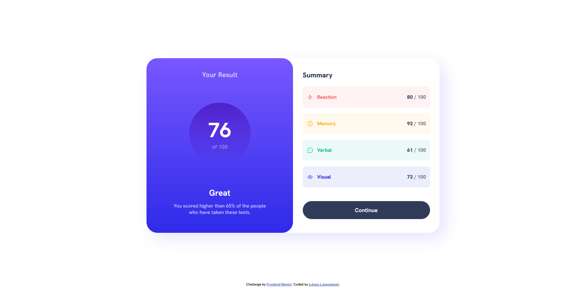

# Frontend Mentor - Results summary component solution

This is a solution to the [Results summary component challenge on Frontend Mentor](https://www.frontendmentor.io/challenges/results-summary-component-CE_K6s0maV). Frontend Mentor challenges help you improve your coding skills by building realistic projects. 

## Table of contents

- [Frontend Mentor - Results summary component solution](#frontend-mentor---results-summary-component-solution)
  - [Table of contents](#table-of-contents)
  - [Overview](#overview)
    - [The challenge](#the-challenge)
    - [Screenshot](#screenshot)
    - [Links](#links)
  - [My process](#my-process)
    - [Built with](#built-with)
    - [What I learned](#what-i-learned)
    - [Continued development](#continued-development)
    - [Useful resources](#useful-resources)
  - [Author](#author)

## Overview

### The challenge

Users should be able to:

- View the optimal layout for the interface depending on their device's screen size
- See hover and focus states for all interactive elements on the page

### Screenshot



### Links

- Solution URL: [Add solution URL here](https://your-solution-url.com)
- Live Site URL: [Add live site URL here](https://your-live-site-url.com)

## My process

### Built with

- Semantic HTML5 markup
- CSS custom properties
- Flexbox
- CSS Grid
- Mobile-first workflow
- Javascript for injecting JSON
- Variable font file

### What I learned

The most influencial thing I learned were basic operations with JSON files and injecting them into HTML.  
The other thing was in this project I first learned about variable fonts and how to declare them in CSS.

```css
@font-face {
  font-family: 'HankenGrotesk';
  src: url(assets/fonts/HankenGrotesk-VariableFont_wght.ttf) format('truetype');
  font-weight: 500 800;
}
```
```js
async function loadJSONData(){
  const response = await fetch('./data.json');
  const names = await response.json();

  let i = 0;
  for(const component of componentsArray){
      component.children[0].children[1].innerHTML = names[i].category;
      component.children[1].children[0].innerHTML = names[i].score;
      component.children[0].children[0].setAttribute("src", names[i].icon);
      i++;
  }
}
```

### Continued development

In future project I plan to use a CSS preprocessor, probably Sass, because the code bloat is getting tiring.
Also, as I'm actively learning jQuery, I plan to use it more often.
Another subject that requires my attention are JS Promises.

### Useful resources

- [CSS Reset](www.joshwcomeau.com/css/custom-css-reset/) - An awesome CSS Reset.
- [Getting started with Variable fonts on the web](https://www.youtube.com/watch?v=0fVymQ7SZw0) - This video helped me implement my first @font-face into CSS.
- [10 CSS Tips](https://youtu.be/Qhaz36TZG5Y?t=406) - This video helped me make a stagger animation for the summary components.

## Author

- Github - [Łukasz Lubaszewski](https://github.com/luckyszakul0)
- Frontend Mentor - [@Lukasz710](https://www.frontendmentor.io/profile/Lukasz710)